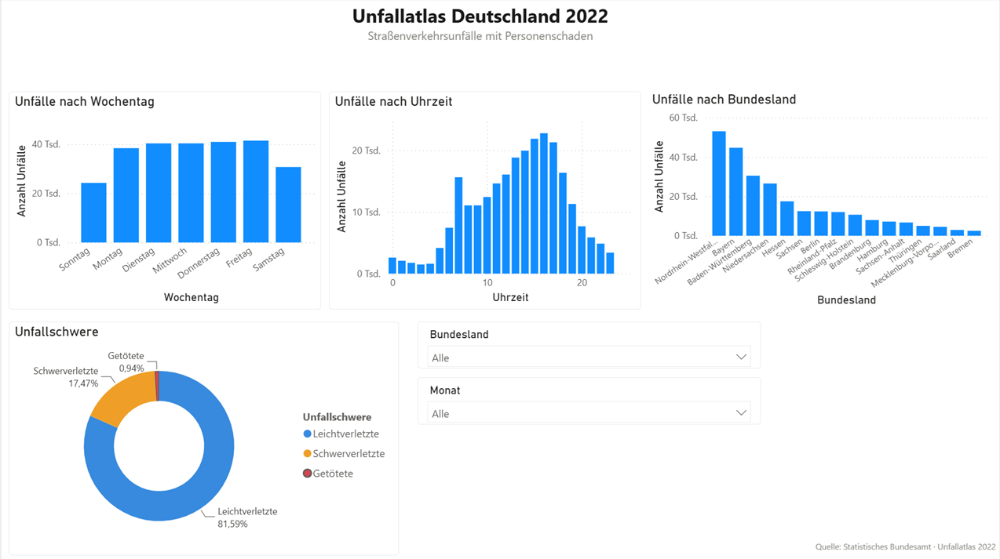
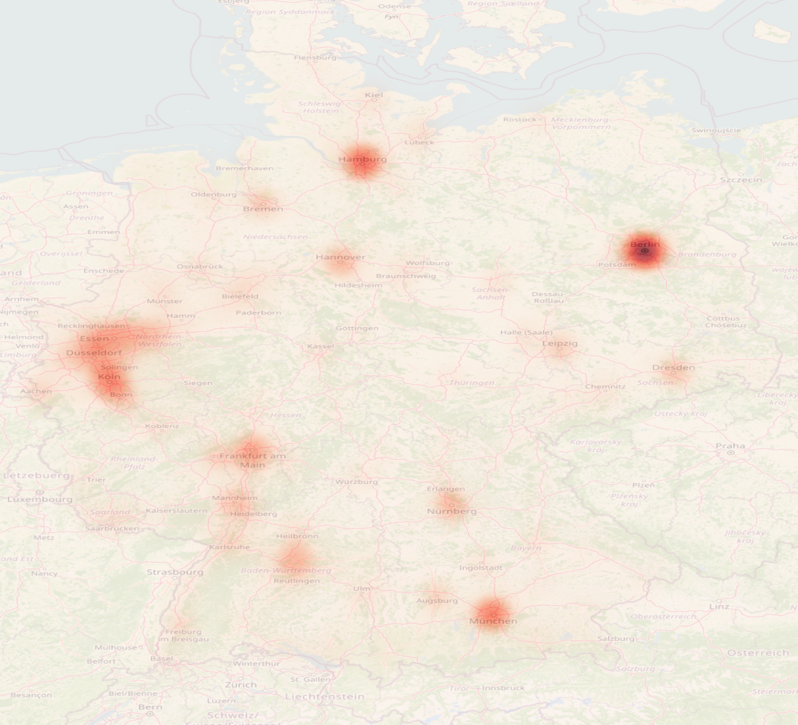

# 🚗 Unfallatlas Deutschland 2022 – Datenanalyse

Analyse von 256.492 Verkehrsunfällen in Deutschland aus dem Jahr 2022.  
Datenquelle: Statistisches Bundesamt – Unfallatlas Deutschland

## 🎯 Fragestellung
Wann und unter welchen Bedingungen passieren die meisten Verkehrsunfälle in Deutschland?

## 📊 Ergebnisse
- **Freitag** hat die höchste Unfallhäufigkeit aller Wochentage
- Die gefährlichsten Stunden sind **15:00 – 17:00 Uhr** (Berufsverkehr)
- Nachts zwischen 0:00 – 5:00 Uhr passieren die wenigsten Unfälle

## Power BI Dashboard

📥 📥 [Dashboard herunterladen](https://github.com/FerhatYasar1/unfallatlas-deutschland-analyse/raw/main/Unfallatlas_Deutschland_2022.pbix)

## 🛠️ Tools & Technologien
- Python (Pandas, Matplotlib, Seaborn)
- Jupyter Notebook
- VS Code

## QGIS Heatmap – Unfallschwerpunkte Deutschland

Visualisierung der 256.492 Unfallstandorte als Heatmap mit OpenStreetMap als Hintergrund.
Erstellt mit QGIS 3.44.

## 📁 Dateien
- `analyse.ipynb` – Komplette Analyse mit Code und Visualisierungen
- `unfaelle_wochentag.png` – Unfälle nach Wochentag
- `unfaelle_uhrzeit.png` – Unfälle nach Uhrzeit

## 👤 Autor
Ferhat Yasar – Data Analyst | Verkehr & Luftfahrt  
[LinkedIn](https://www.linkedin.com/in/ferhat-yasar-37499940a)
